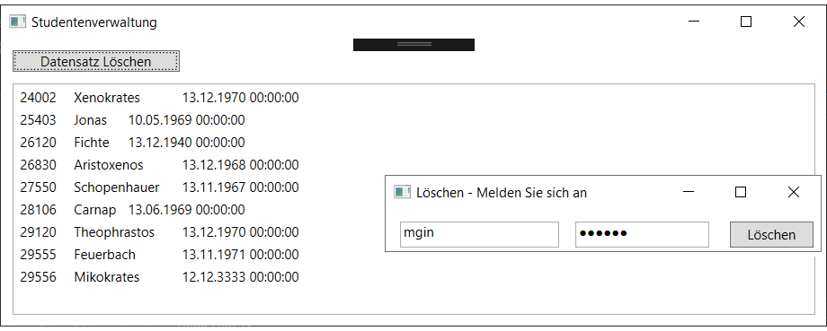

# 6.6 C# - Übungen

## Univerwaltungssystem (207)

Erstellen Sie mittels VisualStudio-C# folgende Anwendung für die Univerwaltung:



- Die Liste der Studenten soll geladen werden beim Öffnen des Programms (Server/User/Kennwort ist im Programm)
- Mit **Datensatz Löschen** kann ein Datensatz gelöscht werden, dazu öffnet sich ein Anmeldefenster das die Zugangsdaten User/Passwort abfragt. Der Datensatz wird dann ohne weitere Rückfrage gelöscht.
- Fehlerbehandlung:
  - wenn kein Datensatz ausgewählt ist und **Datensatz Löschen** ausgewählt wird, dann  wird eine entsprechende Fehlermeldung angezeigt.
  - wenn die Zugangsdaten nicht korrekt sind, wird eine entsprechende Fehlermeldung ausgegeben.

Tipps:

- Listbox *myLb* für die DB-Einträge. Hinzufügen von Einträgen:

  ```c#
  myLb.Items.Add("Nummer" + "\t" + "Name");
  ```

- Rückfragefenster: neues *WPF-Fenster*, z.B. *Window1*

  Im Hauptfenster kann das Fenster dann einfach geöffnet werden:

  ```c#
  Window1 w = new Window1();
  w.ShowDialog();			// Modal     -    Nicht Modal:       w.Show()
  ```

  Wenn sich das Fenster wieder Schließen soll wird darin einfach die Close() Methode aufgerufen:

  ```c#
  this.Close();
  ```

- Messagebox: 

  ```c#
  MessageBox.Show("Fehler...", "Fehler...", MessageBoxButton.OK, MessageBoxImage.Error);
  ```
