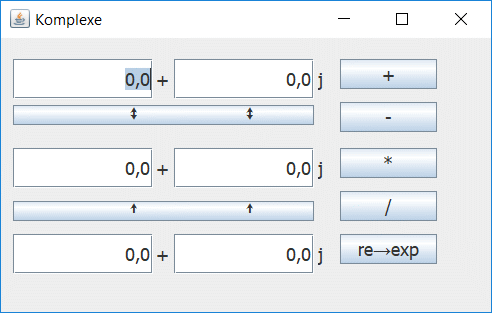

# 11.1 OOP Kapselung - Übungen

## Komplex (110, 007w)

- Erstellen Sie die Klasse **Komplex**.
- Legen Sie die Attribute **re** und **im** an.
- Stelle Sie die Methoden **add()**, **sub()**, **mul()**, **div()**, **konj()** (konjug. komplex) zur Verfügung. 
- Eine Anwendung im selben Paket (Methoden haben paket-Sichtbarkeit) führt Berechnungen mit den Elementen durch.

## Punkt (111, 008w)

Erstellen Sie eine Klasse **Punkt** (grafisches Element). ...

## Schulklasse (112, 009w)

- Erstellen Sie die Klasse **Schueler** mit den Attributen **name** und **gebDat**.
- Erstellen Sie einen Konstruktor, Getter- und Setter-Methoden und eine **toString()** Methode.

- Erstellen Sie die Klasse **Jahrgang** mit den Attributen **name** und **schueler**.
- Erstellen Sie einen Konstruktor, Getter- und Setter-Methoden, eine **toString()** Methode, eine **addSchueler()** und eine **delSchueler()**-Methode.

## Rechteck (113, 006w)

- Erstellen Sie eine Klasse Rechteck und eine Klasse Quadrat. Überlegen Sie welche Klasse allgemeiner/genereller ist und welche Klasse spezieller ist und leiten Sie die spezielle Klasse von der Allgemeinen ab.

- Funktionen: getFlaeche(), getUmfang(), toString()

Testen Sie die Klassen mit geeigneten Testfunktionen

## Bankkonto (010w)

- Erstellen Sie eine Klasse **Bankkunde**. Implementieren Sie folgende Attribute: **vName**, **nName** und **kdNr**.

- Erstellen Sie eine Klasse **Bankkonto**. Ein Konto enthält einen Bankkunden (siehe letztes Beispiel) einen **kontostand** und eine **kontoNr**. Methoden sind **einzahlen** (Cash und von anderen Konto), **auszahlen** (Cash und von anderen Konto).

## Komplexer Taschenrechner (115)

Erstellen Sie ein Projekt KomplexerTaschenrechner:

- Erstellen Sie eine Klasse Komplex
- Erstellen Sie einen Swing-JFrame
- Platzieren Sie die Real-/Imaginärteile für 2 Operanden und ein Ergebnis
- Erzeugen Sie die Schaltflächen +, -, *, /
- Erstellen Sie die notwendigen Klassen für die Berechnung in der Komplex-Klasse

Beispielhafte Oberfläche:

- Wenn ein Textfeld den Fokus erhält, dann wird der gesamte Text markiert.
- Ganze Zahlen werden mit *,0 dargestellt
- Mit den dargestellten Pfeiltasten können Textinhalte kopiert werden
- Mit Re->Exp kann die rechtwinkelige Darstellung in Exponentielle Darstellung umgeschaltet werden.

