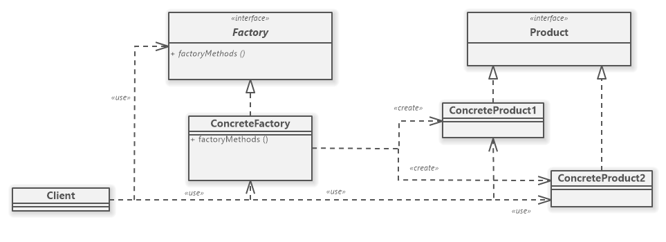
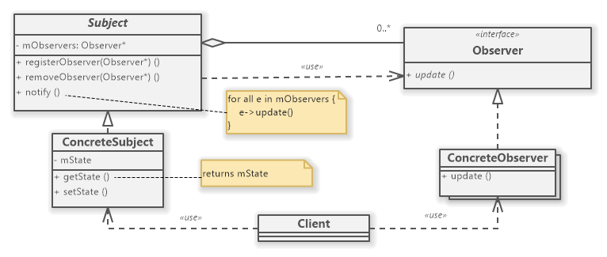
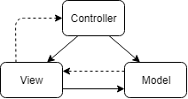
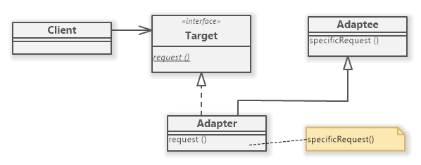

# 5 Entwurfsmuster

(Design Pattern)


Viele Probleme wurden schon gelöst, daher naheliegend: diese Lösungen für die Lösung eigener Probleme verwenden.

Als Entwurfsmuster bereitgestellte Lösungsstrukturen sind **nicht auf Code-Ebene**. Das Muster soll von der Sprache unabhängig einsetzbar sein -> Softwaredesign

Eine sehr bekannte Sammlung von Mustern ist von der **Gang of 4** (**GOF**). Sie haben in einem Klassiker 23 Muster definiert. Die von ihnen gesammelten Muster wurden Gruppiert:

- Erzeugungsmuster: Singleton, Factory
- Strukturmuster: Adapter, Decorator, Fassade
- Verhaltensmuster: Observer, Strategie, Iterator

## Singleton

Ein Singleton ist ein **Erzeugungsmuster**. Es wird verwendet, wenn von einer Klasse immer nur maximal ein alleiniges Objekt erzeugt werden darf.

Typische Anwendung:

- Logging
- Treiber Objekte
- Caching

 Das Muster:

- nur 1 Objekt einer Klasse ist erzeugbar

- Konstruktor ist privat (-> ist nicht aufrufbar)

- die Klasse muss sich das eigene Objekt merken - statische Variable
  
- zur Erzeugung des 1 Objekts wird die statische Methode `getInstance()` erstellt:
  `public: static Singleton& getinstance(){...}`

  diese gibt eine Referenz auf das einzige Objekt zurück

Vorteile gegenüber globalen Variablen:

- es kann eine Zugriffskontrolle realisiert werden
- es kann abgeleitet werden (Spezialisierung)

Oft wird dieses Pattern vereinfacht implementiert, dabei wird das eine Objekt als Attribut gespeichert und bei der Erstellung mittels If überprüft. Da dieser Vorgang kein einzelner Schritt ist, kann er im Fall von Multi-Threading zur Erstellung eines zweiten Objekts führen (Nicht-Thread-Sicher).

Allgemeine Lösung: die Funktion `getInstance` muss Thread-Sicher ausgeführt werden.

 ![[Singleton UML class diagram]](bilder/UML_Pattern_Singleton.png)

c++ Beispiel:

```c++
class Singleton {
public:
	static Singleton& getInstance(){
		static Singleton instance;         // static: once Initialized -> kept
		return instance;
	}
private:
	Singleton() {}                         // Prohibition of "Singleton s;"
	Singleton(const Singleton&) {}         // Prohibition of Singleton s2(s1);
	Singleton& operator=(const Singleton&) { return *this; } // a copy by assign-operator
	~Singleton() {}
};

int main() {
	Singleton &s1= Singleton::getInstance();
	Singleton &s2= Singleton::getInstance();
    //Singleton s3= Singleton::getInstance(); 

    std::cout << "Adresse s1: " << &s1 << std::endl;
    std::cout << "Adresse s2: " << &s2 << std::endl;
	
    return 0;
}
```

s1 und s2 sind Referenzen auf ein und das gleiche Objekt. s3 löst einen Compiler-Fehler aus - damit würde s3 eine Kopie des Objekts sein.

In C++ ist Vorsicht geboten: es gibt in C++ standardmäßig einen Copy-Konstruktor. Wird der Standard-Konstruktor *private* gemacht, dann gibt es noch immer den Copy-Konstruktor. Dieser wird so verwendet:

```c++
MyClass obj1;
MyClass obj2(obj1);		// Erzeugt eine Kopie des Objekts obj1
```

Daher ist (wie in obigem Beispiel) auch der Copy-Konstruktor `Singleton(const Singleton&)` auf *private* zu überschreiben (und damit zu blockieren).

## Factory

Ein *Factory-Pattern* (Fabriksmuster) gehört ebenfalls zu Gruppe der **Erzeugungsmuster**. Häufig wird ein Factory-Pattern als *abstrakte Fabrik* bezeichnet um den Unterschied zu einer Fabrikmethode (siehe Unten) deutlich zu machen. Dieses Pattern kann eingesetzt werden, wenn eine aufrufende Klasse nicht weiß, welche konkreten Klassen und wie diese Klassen zu instanziieren sind. Auch um diese Instanziierung aus Stil-Gründen zu verstecken.

- Mit diesem Pattern können die konkreten Implementierungen voneinander entkoppelt werden.
- Code modularer - die aufrufende Klasse muss den Typen der zu erzeugenden Klasse nicht kennen.
- Dadurch wird der Code wieder verwendbarer.

Aufbau:

- Ein Fabrik-Interface (Erzeuger) wird von einem Klienten (verwendendes Programm) eingebunden
- Eine konkrete Fabrik erzeugt konkrete Produkte durch die Implementierung mittels der abstrakten Schnittstellen. Die Klassen der konkreten Produkte sind die einzigen Stellen an denen die konkreten Produkt-Klassen eingebaut werden (Vorteil).
- Das konkrete Produkt implementiert das abstrakte Produkt-Interface, welches der Klienten aufruft
- Ein Klient fordert mittels der Schnittstellen der abstrakten Fabrik ein Produkt an.

Beispiel:

```
Auto *meins = new Bmw();
```

- Auto soll verwendet werden um flexibel zu bleiben
- auf der rechten Seite müsse wir ganz konkret ein Produkt angeben, wenn der Typ hier unterschiedlich sein kann, dann muss eine vielfache Verzweigung eingebaut werden. Gelöst werden kann diese starre Verbindung mittels Factory.


  

Die hier dargestellte Factory ist eine vereinfachte Form für eine einzelne Fabrik. Erweitert wird dieses Pattern indem unterschiedliche Fabriken die gleichen Produktlinien erzeugen.

### Factory-Methode

Von einer Klasse ist kein Konstruktor verfügbar. Das Erstellen von Objekten der Klasse wird durch den Aufruf einer statischen *createNewInstance()*-Methode ermöglicht.

```
SomeObject o = SomeObjectFactory.createNewInstance();
```

## Observer (287)

Ein Observer gehört zur Gruppe der **Verhaltensmuster**. Er wird verwendet um Veränderungen (an `mState`) an einem Objekt (Subject) an von diesem Objekt abhängige Objekte (`Observer`) weiter zu melden.

- Ein Observer muss sich zu diesem Zweck bei dem Subject anmelden:
  Subject: Methode `registerObserver()`: damit wird ein weiterer Observer in eine Observer-Liste `mObserver` eingefügt (Aggregationsbeziehung)
- Ein Observer muss sich abmelden, wenn er nicht mehr informiert werden soll:
  Subject: Methode `removeObserver()`: Entfernen eines Observer aus der Liste
- Subject: Methode `notify()`: nach jeder Veränderung ruft Subject diese selber auf und ruft damit für jeden gelisteten Observer die Methode `update()` auf.
  - Das Subject sendet in der `update()` Funktion sich selbst als Parameter oder die gewünschte Informationen (push-Variante).
  - Eine zweite Variante ist es, mit `update` den Observer darauf aufmerksam zu machen, dass es neue Daten gibt - diese können dann nach Bedarf mit einem Getter `getState` vom `ConreteSubject` abgerufen werden (pull-Variante).
- Observer: mit der `update()`-Methode wird die `getState()` Methode des Subject aufgerufen um die notwendigen Daten abzurufen.

Ein Observer ist eine *Eins-zu-Viele-Abhängigkeit* (Ein Subject <-> Viele Observer).



c++-Beispiel:

https://de.wikipedia.org/wiki/Beobachter_(Entwurfsmuster)

## Iterator

Ein **Iterator** gehört zur Gruppe der Verhaltensmuster. Dieses Muster sei hier erwähnt, die Anwendung und Funktion ist in Standard-Template-Library für die Collections implementiert.

## Model-View-Control MVC

Das MVC-Pattern ist Keines der GoF, allerdings hat es sich für GUI-Anwendungen sehr bewährt. Dabei geht es darum graphische Kontrollelemente von der Logik zu trennen:

  

Beispielhaft soll mittels einer Datenbankanwendung Listen in einer Applikation dargestellt werden. In einer ersten Implementierung würde das ein ständiges Wechselspiel von GUI-Events und Datenbankzugriffen zur Folge haben. Ein Problem entsteht, wenn die Anwendung auf einem anderem System (Linux, Windows, Mobil, Desktop ...) laufen soll, dann muss die komplette Anwendung neu erstellt werden. Aber genauso wenn die Daten eine andere Struktur aufweisen.

Aus diesem Grund wird der angezeigte Teil (**View**) komplett vom Datensatz (**Modell**) getrennt. Damit die Daten in der View und im Modell gleich sind wird ein **Controller** benötigt, der kümmert sich um das Kopieren der Daten View<->Modell. Das kann als Ursache eine Veränderung der Datenquelle für das Modell haben (Datenbankzugriff ...) oder ein Verändern der Daten auf der GUI-Seite (View) etwa durch eine Eingabe o.ä.

Vorteile:

- Änderungen in der Programmlogik haben keine Auswirkung auf die graphische Darstellung und können unabhängig erfolgen.
- Die Darstellung ist unabhängig von der (eventuell komplexen) Logik und kann unabhängig von den anderen Teilen verändert werden.

Dieses Konzept ist nach außen in Abwandlungen realisiert, so zum Beispiel in Qt-C++, Java-Swing oder C#-WPF (MVVM). Dort ist jeweils nur ein Modell für die GUI-Klasse (View) verfügbar, der Controller ist im View integriert.

### Qt-ListView (156)

Allgemein hat es ja nicht viel Sinn dieses Konzept für ein einfaches Textfeld zu verwenden. Der Vorteil ist erst dann gegeben wenn es sich um größere Datenmengen handelt, für Qt gibt es so etwa ein List-View (*QListView*) für die Darstellung einer Liste von Daten:

- Zuerst wird auf einem UI ein *View* *QListView* mit Namen *lstNamen* erstellt

- Als Modell wird eine Modell-Variable angelegt (zum Beispiel in *mainwindow.h*):

  ```c++
  QStringListModel *model;           // Modell
  ```

- Das *lstNamen-QListView* wird mit dem *model*-Modell verknüpft (z.B. im Konstruktor):

  ```c++
  model = new QStringListModel(this);
  ui->lstNamen->setModel(model);     // ListView--Element vom GUI
  ```

- Damit können im Modell Elemente verändert werden:

  ```c++
  model->insertRows(0,3);						// 3 Elemente an Pos 0 einfügen
  model->setData(model->index(0), "Hans");	// erstes Element
  model->setData(model->index(1), "Fritz");
  model->setData(model->index(2), "Klaus");
  ```

  Diese Veränderungen werden automatisch im GUI in der verknüpften Liste angezeigt.

In Qt gibt es einige Elemente bei denen das möglich ist wie etwa auch in einer ComboBox. Nicht alle Elemente lassen es zu dass ein Modell verknüpft wird (sind dann private).

Vorteil: im Programm muss man sich nur um das Modell kümmern, dargestellt werden die Daten automatisch.

## Adapter

Ein Adapter, auch Wrapper ist ein **Struktur-Muster**. Er wird verwendet um Schnittstellen anzupassen.

Problemstellung:

- Ein Client greift in einer gewissen Form auf eine Schnittstelle zu `request()`.
- Ein Dienst (Adaptee) bietet die Schnittstelle in einer anderen Form an `specificRequest()`
- Beide, Client und Dienst sollen nicht angepasst werden, der Zugriff trotzdem möglich sein




Ein Client greift auf `request()` von `Target` zu. Verfügbar für diese Anforderung ist lediglich `specificRequest` von `Adaptee`. Es wird eine *Adapter*-Klasse erstellt: 

```c++
class Target {// Target-Interface with request()
public:
    virtual void request() = 0;
};

class Adaptee {  // Existing interface which specificRequest needs adapting
public:
    Adaptee() {
        cout << "Adaptee:  Construktor" << endl;
    }
    void specificRequest() {
        cout << "Adaptee:  specificRequest()" << endl;
    }
};

class Adapter: public Target, private Adaptee { // Adapter/Wrapper
public:
    Adapter() {
        cout << "Adapter: Construktor" << endl;
    }
    virtual void request() {
        cout << "Adapter: request()" << endl;
        specificRequest();
    }
};

int main() {
    cout << "main: creating Target." << endl;
    Target *my = new Adapter();
    cout << "main: Target.request()" << endl;
    my->request();
}
```

In `main` (Client) wird ein `Target` erstellt mittels `Adapter`. Der Client erhält eine Schnittstelle wie sie benötigt wird. Die Klasse`Adaptee` bleibt ebenfalls unverändert.

Beispielhaft gibt es in Java die Wrapper-Klasse *Integer* für den Datentypen `int`. Diese Klasse Kapselt (wrappt) den Datentyp in eine Klasse um etwa eine Liste erstellen zu können (Adapter-Funktion) und um zusätzliche Features anbieten zu können (Decorator).

Stream-Klassen sind ungebuffert, für die gebufferte Anwendung werden sie in Buffered-Stream-Klassen eingebettet.

## Referenzen

- Kompakte/Einfache Übersicht
   http://www.inztitut.de/blog/glossar/software-pattern/ 
- Sehr ausführliche und verständliche Ausführung
   https://www.philipphauer.de/study/se/design-pattern.php
- Brücke
   https://www.tutorialspoint.com/design_pattern/bridge_pattern.htm